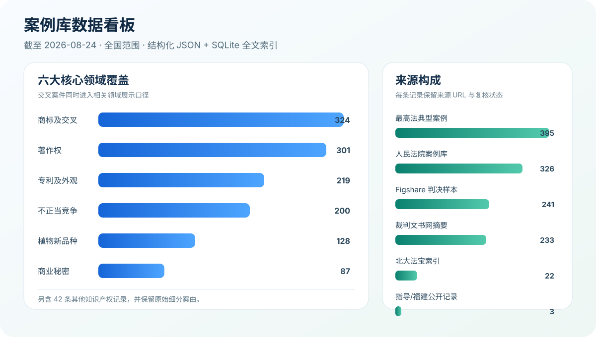
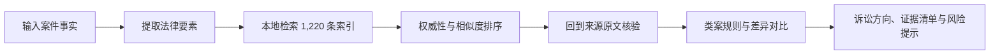

<p align="center">
  
</p>

<p align="center">
  <a href="https://github.com/Dekkon717/Case-Search-in-Chinese-Intellectual-Property/releases"></a>
  
  
  
  <a href="LICENSE"></a>
</p>

<p align="center">
  <strong>把一段知识产权案情，转化为可检索、可比较、可回溯原文的类案研究报告。</strong>
</p>

这是一个可安装到 Codex 的中国知识产权法律研究 Skill。它面向商标、著作权、专利、不正当竞争、商业秘密和植物新品种纠纷，将自然语言案情拆成法律要素，在本地案例库中寻找相似案件，并按照来源权威性、事实相似度和证据可用性组织诉讼方向。

> [!IMPORTANT]
> 本项目是法律研究辅助工具，不是律师意见、诉讼结果承诺或自动裁判系统。公开裁判数据存在选择偏差；案号、事实、法条、金额和裁判主文必须回到来源原文逐案核验。

## 它解决什么问题

| 你通常遇到的问题 | Skill 提供的帮助 |
| --- | --- |
| 不知道该用哪些关键词找类案 | 自动提取权利基础、侵权行为、抗辩、证据与救济要素 |
| 搜到很多结果，却无法判断哪些更重要 | 按权威层级、事实相似度和可核验程度组织候选案例 |
| 类案结论零散，难以形成诉讼思路 | 输出争议焦点、规则对比、证据缺口、风险与下一步建议 |
| 担心 AI 编造案号或结论 | 强制保留来源 URL、核验状态和不确定性说明 |
| 案件材料不适合上传第三方 | SQLite 与检索脚本均可在本地运行 |

## 数据一览

<p align="center">
  
</p>

- 当前内置 **1,220 条**全国知识产权案例索引，由原 610 条翻倍扩容。
- 扩容前清理旧库跨来源重复 23 条；795 条候选中再清理 89 条重复，选入 633 条，最终净增加 610 条。
- 最终 `case_id` 全部唯一，已知案号重复组为 0，JSON、SQLite 与全文索引数量一致。
- 来源包括最高人民法院年度典型案例、人民法院案例库、中国裁判文书网列表摘要、Figshare CC BY 4.0 数据集、北大法宝检索索引等。
- 领域标签允许交叉归类，因此上图各领域数量之和可能大于案例总数。

完整计算关系、质量检查与局限性见《[案例库扩容与质量分析日志](docs/ANALYSIS-LOG-2026-08-24.md)》；机器可读审计见 [`expansion-audit.json`](data/national-ip-corpus/expansion-audit.json)。

## 覆盖领域

| 领域 | 可分析的典型问题 |
| --- | --- |
| 商标 | 商标性使用、混淆可能性、合法来源、商标不使用抗辩、惩罚性赔偿 |
| 著作权 | 作品类型、权属链、接触与实质性相似、合理使用、软件与短视频侵权 |
| 专利 | 权利要求比对、等同侵权、现有技术抗辩、专利权评价、恶意诉讼线索 |
| 不正当竞争 | 混淆、虚假宣传、商业诋毁、网络流量与平台竞争行为 |
| 商业秘密 | 秘密性、保密措施、接触可能性、实质相同、损害与举证责任 |
| 植物新品种 | 品种权基础、繁殖材料、检测鉴定、合法来源与赔偿 |

## 工作方式



Skill 不会只返回“像不像”或一个胜诉概率。它要求把支持结论和不支持结论的案例同时列出，并区分：已经从原文确认的事实、仅从索引获得的信息、仍需人工复核的推断。

## 30 秒安装

在仓库根目录打开 PowerShell，运行：

```powershell
powershell -ExecutionPolicy Bypass -File .\scripts\install_skill.ps1
```

脚本会将 Skill 和内置案例库安装到：

```text
%USERPROFILE%\.codex\skills\fujian-ip-litigation
```

安装后，可在 Codex 中直接说：

```text
$fujian-ip-litigation
我方经营一家网店，被诉销售的产品包装与原告注册商标近似，
进货单据和付款记录齐全。请检索相似案例，重点分析商标性使用、
混淆可能性、合法来源抗辩、证据缺口及赔偿区间。
```

典型输出结构：

1. 案情要素与缺失信息；
2. 适用规则与时点；
3. 支持、反向及区分案例表；
4. 类案异同与裁判趋势；
5. 原告/被告诉讼方向；
6. 证据补强清单、风险和核验链接。

## 独立使用本地案例库

不调用完整 Skill，也可以直接使用检索脚本：

```powershell
python scripts/search_cases.py --db .\data\national-ip-corpus\cases.db --query "软件 著作权" --limit 10
python scripts/validate_corpus.py --db .\data\national-ip-corpus\cases.db
```

如要建立自己的案例库，请先阅读 [`data-workflow.md`](references/data-workflow.md)、[`schema.md`](references/schema.md) 和 [`safety-rules.md`](references/safety-rules.md)。导入前必须脱敏，不得把客户材料写入公共仓库。

## 项目索引

| 路径 | 用途 |
| --- | --- |
| [`SKILL.md`](SKILL.md) | Skill 主指令、分析边界和完整工作流 |
| [`agents/openai.yaml`](agents/openai.yaml) | Codex 显示名称、默认提示词和调用策略 |
| [`references/domain-routing.md`](references/domain-routing.md) | 六个领域的路由与要素清单 |
| [`references/source-ranking.md`](references/source-ranking.md) | 来源层级与核验顺序 |
| [`references/report-template.md`](references/report-template.md) | 类案分析报告模板 |
| [`references/schema.md`](references/schema.md) | JSON/SQLite 字段定义 |
| [`scripts/search_cases.py`](scripts/search_cases.py) | 本地结构化类案检索 |
| [`scripts/expand_ip_corpus.py`](scripts/expand_ip_corpus.py) | 公开数据扩容与去重审计 |
| [`scripts/validate_corpus.py`](scripts/validate_corpus.py) | 数据结构和质量检查 |
| [`scripts/install_skill.ps1`](scripts/install_skill.ps1) | Windows 一键安装 |
| [`data/national-ip-corpus/`](data/national-ip-corpus/) | 全国案例索引、数据库、来源登记与审计 |

## 数据、合规与可复核性

来源登记在 [`source-registry.json`](data/national-ip-corpus/source-registry.json)。项目只处理公开资料、公开许可数据或用户已获授权会话中可见的索引信息，不破解验证码、反爬机制或付费墙，也不把来源网站的全文作为公开镜像重新分发。

新增记录保留来源 URL、案号、法院、日期、案由、可见摘要、采集方式和核验状态。`machine_extracted` 或“待二次核验”表示该记录适合发现线索，不应未经原文确认直接写入正式法律意见。

## 参与项目

欢迎提交 Issue、补充可公开核验的案例来源、改进领域标签或贡献脱敏测试。请先阅读 [`CONTRIBUTING.md`](CONTRIBUTING.md)。代码按 MIT License 发布；来源网站内容、裁判文书版权、访问条款和个人信息保护义务仍由使用者承担。

如果这个项目对你的法律检索或学习有帮助，欢迎点一个 **Star**，让更多人发现它。
